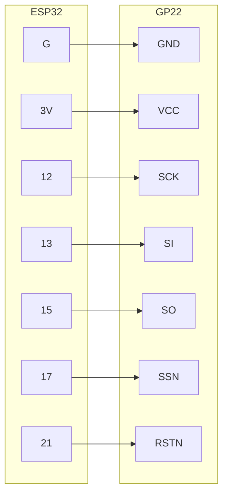

# 硬件部分



1. 数据表推荐用线性电源供电以避免噪声，这里偷懒，直接用esp32的3.3V输出。
2. esp32的pin 12, 13, 15, 17组成4线Software SPI与GP22通信，pin 21控制GP22，高电平使能GP22。
3. 可用如下代码做SPI通信测试。

```python
from machine import SoftSPI, Pin
import binascii

#
# GP22   ESP32             4-wire SPI
# SSN -- 17                CS
# SCK -- 12                CLK
# SO  -- 15                MISO
# SI  -- 13                MOSI
# 
# RSTN -- 21                RST for GP22, high to enable the chip
#
#                          polarity=0, phase=1, MSB

# config 4-wire SPI
spi = SoftSPI( sck=Pin(12), mosi=Pin(13), miso=Pin(15), polarity=0, phase=1, firstbit=SoftSPI.MSB )
spi.init()
cs = Pin(17, mode=Pin.OUT, value=1)
rst = Pin(21, mode=Pin.OUT, value=1) # high enable gp22

# write a test byte to reg1's higest 8 bits
cs(0)
spi.write(b'\x81\x89')   # we choose b'\x89' as a test byte
cs(1)

# read from reg5
cs(0)
spi.write(b'\xB5')
dat = spi.read(1)
cs(1)
binascii.hexlify(dat)  # should give the test byte b'\x89'
```

4. 常见的gp22模块为标注为"CJMCU-22"的黑色板子，taobao可以找到两种，注意买带STA引脚输出的模块。引脚对应

| 模块引脚 | GP22引脚                             |
| -------- | ------------------------------------ |
| SP1      | 通过C1连接STOP1，通过R2连接FIRE UP   |
| SP2      | 通过C2连接STOP2，通过R1连接FIRE DOWN |
| STA      | START                                |
| DIS      | EN_START                             |

TOF不需要R1, C1, R2, C2. 建议C1, C2改成短接，R1, R2直接断路。

两个VCC内部短路，连接一个即可，3.3V供电。

FIN对应gp22的fire pulse generator，TCD/PT1/PT2/THT对应gp22的temperature unit，这两个模块都不需要，FIN接地，其余悬空。(参考数据表Figure 2-6 TDC-GP22 Pinout)


# Micropython驱动

micropython esp32 缺省firmware不支持double float。需要自行编译固件

```
make MICROPY_FLOAT_IMPL = MICROPY_FLOAT_IMPL_DOUBLE
```

