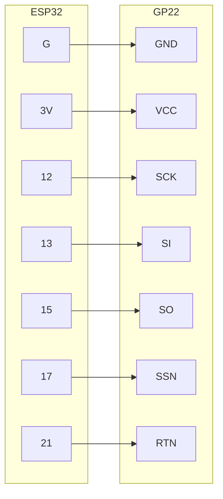

# GP22 Key Features

* Single-shot resolution: 90ps
* Range: 3.5ns ~ 2.5us (mode 1), 700ns ~ 4ms (mode 2)
* Minimum pulse width : 2.5ns
* Minimum pulse pair resolution: 20ns (mode 1), 500ns(700ns?) (mode 2)

# Wire Up


1. SP1 is connected to GP22's FIRE DOWN via R2 and STOP1 via C1; 

   SP2 is connected to GP22's FIRE DOWN via R1 and STOP1 via C2.

   This is designed for ultrasonic flow meter. For TOF, remove R1 and R2, replace C1 and C2 by short circuit.

2. VCC works for 3.3V. Two VCC pins are internal shorted.

3. FIN corresponds to GP22's fire pulse generator, TCD, PT1, PT2 and THT correspond to GP22's temperature unit，they are not used for TOF. According to "Figure 2-6 TDC-GP22 Pinout" in GP22's datasheet, FIN should be grounded.

4. DIS is connected to EN_START of GP22.

5. SPI connection



SPI testing code

```python
from machine import SoftSPI, Pin
import binascii

#### esp32 ####
#
# GP22   ESP32             4-wire SPI
# SSN -- 17                CS
# SCK -- 12                CLK
# SO  -- 15                MISO
# SI  -- 13                MOSI
# 
# RTN -- 21                RST for GP22, high to enable the chip
#
#                          polarity=0, phase=1, MSB

# ESP32 : config 4-wire SPI
spi = SoftSPI( sck=Pin(12), mosi=Pin(13), miso=Pin(15), polarity=0, phase=1, firstbit=SoftSPI.MSB )
spi.init()
cs = Pin(17, mode=Pin.OUT, value=1)
rst = Pin(21, mode=Pin.OUT, value=1) # high enable gp22

#### test spi interface #### 

# write a test byte to reg1's higest 8 bits
cs(0)
spi.write(b'\x81\x89')   # we choose b'\x89' as a test byte
cs(1)

# read from reg5
cs(0)
spi.write(b'\xB5')
dat = spi.read(1)
cs(1)
binascii.hexlify(dat)  # should give the test byte b'\x89'
```

# Micropython driver

GP22 returns 32bits Q-format fixed float. This requires double float, which is not supported in default esp32 firmware. Compile the firmware with the following command to enable double float

```makefile
make MICROPY_FLOAT_IMPL = MICROPY_FLOAT_IMPL_DOUBLE
```

As the resolution of GP22 is ~ 90pS, it is adequate to use single precision float in esp32. Hence double float is is necessary.


